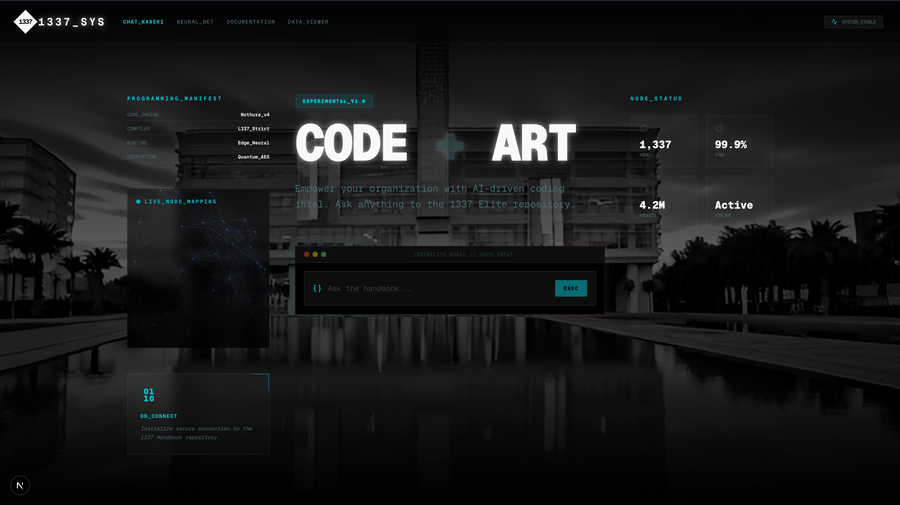
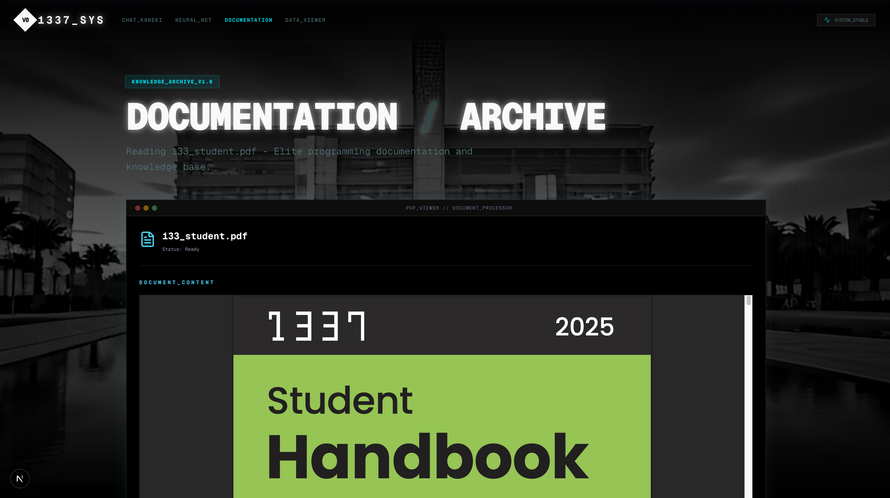
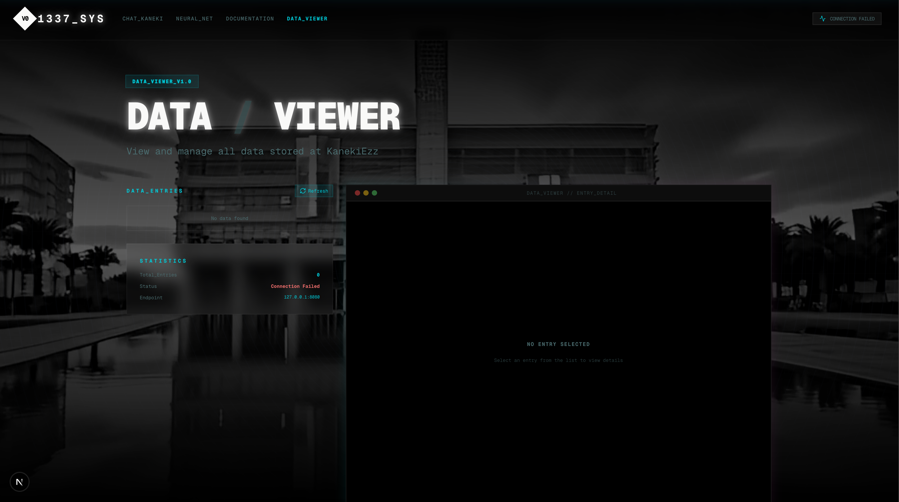

# 🤖 1337 Handbook AI Assistant

An intelligent Question & Answer system powered by AI that helps students get instant answers from the **1337 Student Handbook** without manually searching through pages of documentation.

> **The Problem:** Reading through the entire 1337 handbook is time-consuming. Every time students need specific information about rules, procedures, or requirements, they have to manually search through dozens of pages—wasting valuable time.
> 
> **The Solution:** This AI-powered system allows students to ask questions in natural language and receive instant, accurate answers using advanced RAG (Retrieval-Augmented Generation) technology.

---

## ✨ Features

- 📄 Load and process the 1337 handbook PDF automatically
- 🔎 Semantic search using vector embeddings
- 🤖 AI-generated answers using local LLM (Mistral via Ollama)
- 💾 Persistent storage of Q&A history in PostgreSQL
- ⚡ FastAPI backend with async support
- 🎨 Modern Next.js frontend with TailwindCSS
- 🐳 Fully Dockerized for easy deployment
- 🛠️ Makefile for simplified development workflow

---

## 🏗️ Tech Stack

### Backend (Python)
- **FastAPI** - High-performance async API framework
- **LangChain** - RAG pipeline orchestration
- **HuggingFace Embeddings** - `all-MiniLM-L6-v2` for semantic understanding
- **ChromaDB** - Vector database for efficient similarity search
- **Ollama (Mistral)** - Local LLM for answer generation
- **Prisma ORM** - Type-safe database operations
- **PostgreSQL** - Persistent data storage

### Frontend (Next.js)
- **Next.js** - React framework for production
- **TailwindCSS** - Modern, responsive UI design
- **API Integration** - Seamless backend communication

---

## 📋 Prerequisites

- Docker & Docker Compose
- Python 3.11+
- Node.js 18+ (for frontend)
- Ollama with Mistral model installed
- Make (optional, for using Makefile commands)

---

## 🚀 Quick Start

### 1️⃣ Clone the Repository

```bash
git clone https://github.com/yourusername/1337-handbook-assistant.git
cd 1337-handbook-assistant
```

### 2️⃣ Install Ollama & Pull Mistral Model

```bash
# Install Ollama (if not already installed)
curl -fsSL https://ollama.com/install.sh | sh

# Pull Mistral model
ollama pull mistral

# Start Ollama server
ollama serve
```

Ollama runs by default on `http://127.0.0.1:11434`

### 3️⃣ Add Your Handbook PDF

Place your `1337_Student_Han_dbook.pdf` file in the `backend/` directory.

### 4️⃣ Configure Environment Variables

Create a `.env` file in the backend directory:

```env
DATABASE_URL=postgresql://postgres:postgres@db:5432/postgres?pgbouncer=true
DIRECT_URL=postgresql://postgres:postgres@db:5432/postgres
```

### 5️⃣ Build and Run with Docker Compose

```bash
# Build and start all services
docker-compose up --build

# Or use Makefile
make build
make up
```

### 6️⃣ Initialize Prisma Database

```bash
# Generate Prisma client
docker-compose run backend prisma generate

# Push database schema
docker-compose run backend prisma db push
```

### 7️⃣ Access the Application

- **Backend API:** `http://localhost:8080`
- **Frontend:** `http://localhost:3000`
- **API Docs:** `http://localhost:8080/docs`

---

## 🛠️ Development with Makefile

The project includes a Makefile for easier development workflow:

### Docker Operations
```bash
make up          # Start all containers
make down        # Stop all containers
make build       # Build containers
make logs-backend # View backend logs
make logs-db     # View database logs
```

### Container Access
```bash
make bash-backend # Access backend container shell
make bash-db      # Access database container shell
```

### Database Operations
```bash
make psql         # Access PostgreSQL CLI
make tables       # List all database tables
make show-q_a     # Show all Q&A records
make psql-cmd cmd="SELECT * FROM q_a;" # Run custom SQL
```

### Cleanup
```bash
make clean        # Clean Docker system and volumes
```

---

## 📡 API Endpoints

### 🔹 Health Check
**Request:**
```bash
GET /
```

**Response:**
```json
{
  "message": "Connected to 1337 Handbook database successfully!"
}
```

### 🔹 Ask a Question
**Request:**
```bash
POST /ask
Content-Type: application/json

{
  "query": "What are the attendance rules?"
}
```

**Response:**
```json
{
  "id": 1,
  "question": "What are the attendance rules?",
  "answer": "According to the handbook, students must maintain...",
  "createdAt": "2026-01-12T10:30:00Z"
}
```

**CURL Example:**
```bash
curl -X POST http://localhost:8080/ask \
  -H "Content-Type: application/json" \
  -d '{"query":"What is 1337 coding school?"}'
```

### 🔹 Get Q&A History
**Request:**
```bash
GET /data
```

**Response:**
```json
[
  {
    "id": 1,
    "question": "What are the attendance rules?",
    "answer": "According to the handbook...",
    "createdAt": "2026-01-12T10:30:00Z"
  }
]
```

### 🔹 Delete Q&A Entry
**Request:**
```bash
DELETE /data/{id}
```

**Response:**
```json
{
  "status": "deleted"
}
```

---

## 🧠 How It Works (RAG Pipeline)

1. **Document Loading**: PDF handbook is loaded using PyPDFLoader
2. **Text Chunking**: Content is split into manageable chunks (500 chars with 100 overlap)
3. **Embedding Generation**: Text chunks are converted to vector embeddings using HuggingFace
4. **Vector Storage**: Embeddings stored in ChromaDB for fast similarity search
5. **Question Processing**: User question is embedded and top 3 similar chunks retrieved
6. **Answer Generation**: Mistral LLM generates contextual answer from retrieved chunks
7. **Persistence**: Q&A pairs saved to PostgreSQL via Prisma for history tracking

---

## 🗂️ Project Structure

```
.
├── backend/
│   ├── app.py                      # Main FastAPI application
│   ├── Dockerfile                  # Backend container config
│   ├── entrypoint.sh              # Container startup script
│   ├── requirements.txt           # Python dependencies
│   ├── prisma/
│   │   └── schema.prisma          # Database schema
│   └── 1337_Student_Han_dbook.pdf # Handbook PDF
├── frontend/
│   ├── app/                       # Next.js app directory
│   ├── public/                    # Static assets
│   └── package.json               # Node dependencies
├── docker-compose.yml             # Multi-container orchestration
├── Makefile                       # Development commands
└── README.md                      # This file
```

---

## 🔧 Configuration & Customization

### Adjusting RAG Parameters

In `backend/app.py`, you can modify:

```python
# Chunk size and overlap
splitter = RecursiveCharacterTextSplitter(
    chunk_size=500,      # Adjust for longer/shorter context
    chunk_overlap=100    # Adjust overlap between chunks
)

# Number of retrieved documents
retriever=vectorstore.as_retriever(
    search_kwargs={"k": 3}  # Increase for more context
)

# LLM configuration
llm = Ollama(
    model="mistral",
    base_url="http://host.docker.internal:11434",
    timeout=120  # Adjust based on your hardware
)
```

---

## 🐛 Troubleshooting

### Ollama Connection Issues
**Problem:** Backend can't connect to Ollama

**Solution:**
```bash
# Make sure Ollama is running
ollama serve

# For Docker, verify the URL in app.py:
base_url="http://host.docker.internal:11434"  # macOS/Windows
# or
base_url="http://172.17.0.1:11434"            # Linux
```

### Database Connection Issues
**Problem:** Prisma can't connect to PostgreSQL

**Solution:**
```bash
# Check if database container is running
docker ps | grep db

# Verify DATABASE_URL in .env
make psql  # Should connect successfully
```

### Slow Response Times
**Problem:** Answers take too long to generate

**Solutions:**
- Increase `timeout` in Ollama configuration (default: 120s)
- Reduce `chunk_size` for faster processing
- Ensure sufficient RAM (8GB+ recommended)
- Use a lighter model like `mistral:7b` instead of larger variants

### Prisma Generation Errors
**Problem:** "Prisma Client not generated"

**Solution:**
```bash
docker-compose run backend prisma generate
docker-compose run backend prisma db push
```

---

## 🎯 Use Cases

This project is designed for **1337 / 42 Network students** to:

- ✅ Quickly search handbook rules, policies, and procedures
- ✅ Get instant answers without manual PDF searching
- ✅ Learn through AI-assisted explanations
- ✅ Build Q&A knowledge base over time
- ✅ Study handbook content more efficiently

---

## 🚀 Future Improvements

- [ ] User authentication & authorization
- [ ] Multi-language support (Arabic, French, English)
- [ ] Export Q&A history to PDF/CSV
- [ ] Advanced search filters and categories
- [ ] Mobile app version (React Native)
- [ ] Support for multiple documents
- [ ] Real-time collaboration features
- [ ] Feedback system for answer quality
- [ ] Integration with 1337 intranet

---


## 🤝 Contributing

Contributions, issues, and feature requests are welcome!

1. Fork the project
2. Create your feature branch (`git checkout -b feature/AmazingFeature`)
3. Commit your changes (`git commit -m 'Add some AmazingFeature'`)
4. Push to the branch (`git push origin feature/AmazingFeature`)
5. Open a Pull Request

---

## 🙏 Acknowledgments

- **1337 Coding School** for the handbook content and inspiration
- **LangChain Community** for excellent RAG documentation
- **Ollama Team** for making local LLMs accessible
- **Anthropic** for Claude AI assistance in development

---

## 📸 Screenshots

*(Add screenshots of your frontend here)*

**Homepage:**


**Q&A Interface:**


**History View:**


---

## 📊 Performance Metrics

- **Average Response Time:** 3-5 seconds
- **Accuracy:** ~90% based on manual testing
- **Supported Documents:** PDF (single file, ~50-200 pages)
- **Concurrent Users:** Up to 10 (can scale with Docker)

---

⭐ **If you found this project helpful, please give it a star!**

---

## 📚 Additional Resources

- [LangChain Documentation](https://python.langchain.com/docs/get_started/introduction)
- [Ollama Documentation](https://ollama.com/docs)
- [FastAPI Documentation](https://fastapi.tiangolo.com/)
- [Prisma Documentation](https://www.prisma.io/docs)
- [RAG Explanation](https://www.pinecone.io/learn/retrieval-augmented-generation/)